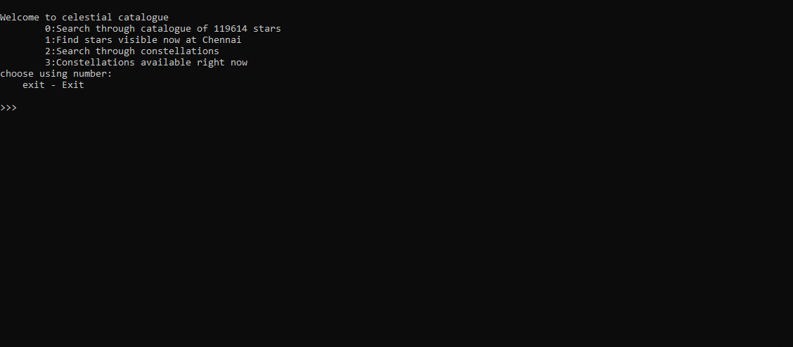
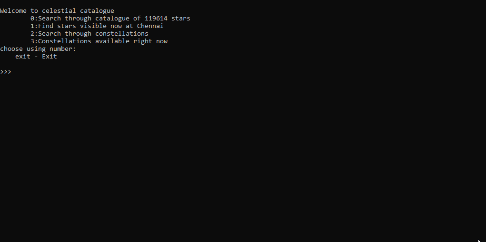

# Celestial Catalogue
Since this project was made long back when i was a total novice to programming, please forgive for the clumsy inefficient code, inaccuracies and user experience.
<br>
RETRO style astrophysics ;)

## DESCRIPTION
This is a menu driven program to search through the catalogue of stars and constellations to checkout their current positions and other properties like luminocity, meaning of their names and so on.... 
<br>
You can also view all constellations visible from your location right now

## INSTALLATION

```bash
git clone 
cd 
pip install tabulate
py main.py
```

## INFORMATIONS
- use `cache_all.py` to make pickle files from csv star data archieve
- all the data used here is also in CSV format in data dir.
- update `your_location` variable in `main.py` with your coordinates
## CONTRIBUTIONS
this is just a fun project for learning.<br>
I would appriciate any inconsistancies being addressed on the calculations part. I was little iffy on that while writing this code.
<br>
I hope you guys will also find it fun to play around with it.

## PREVIEW 


